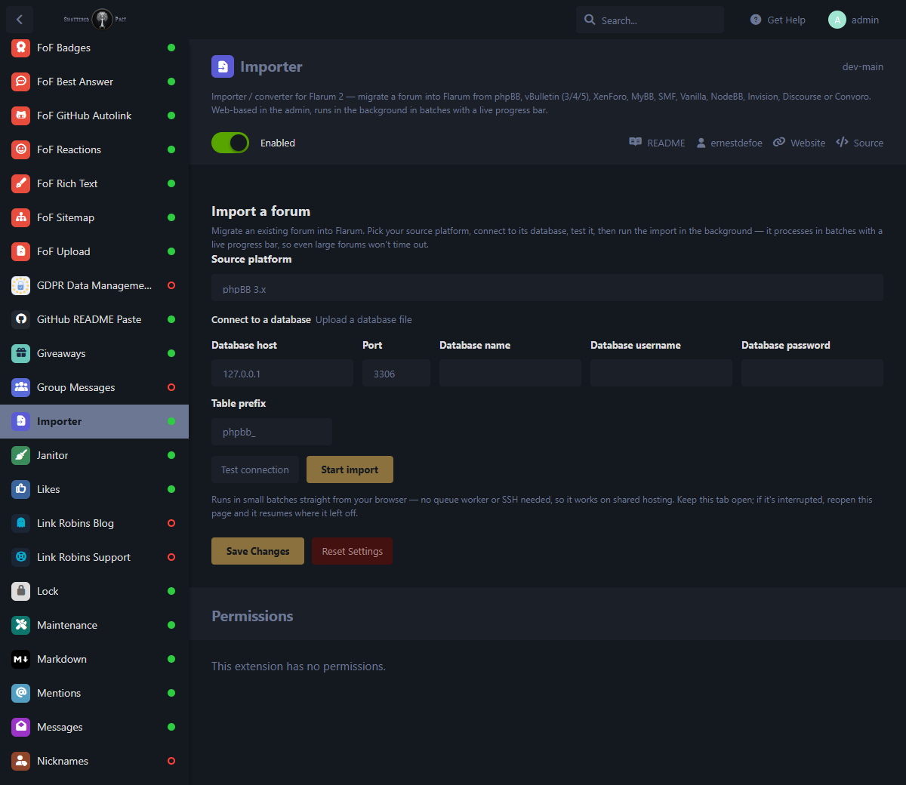
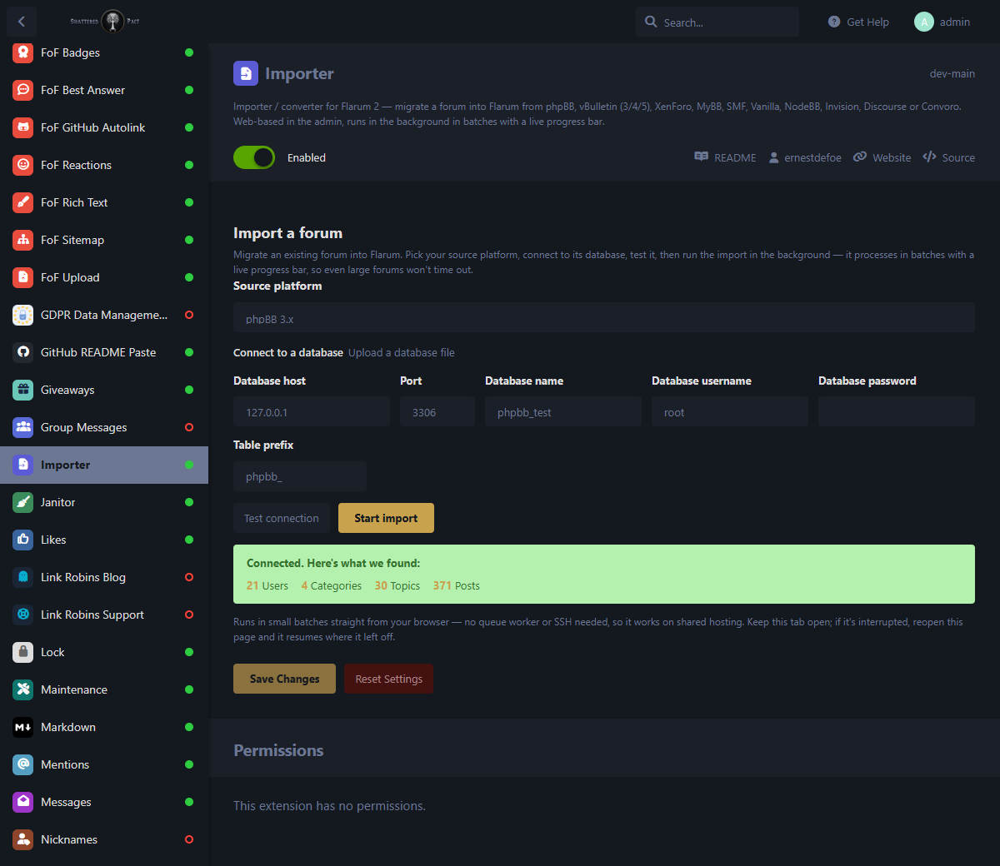
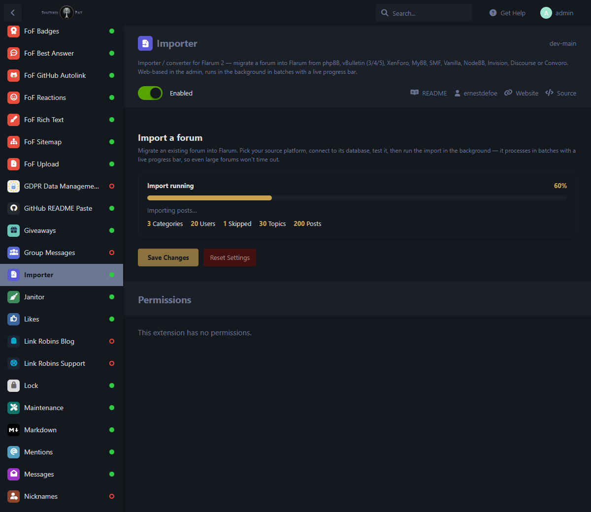
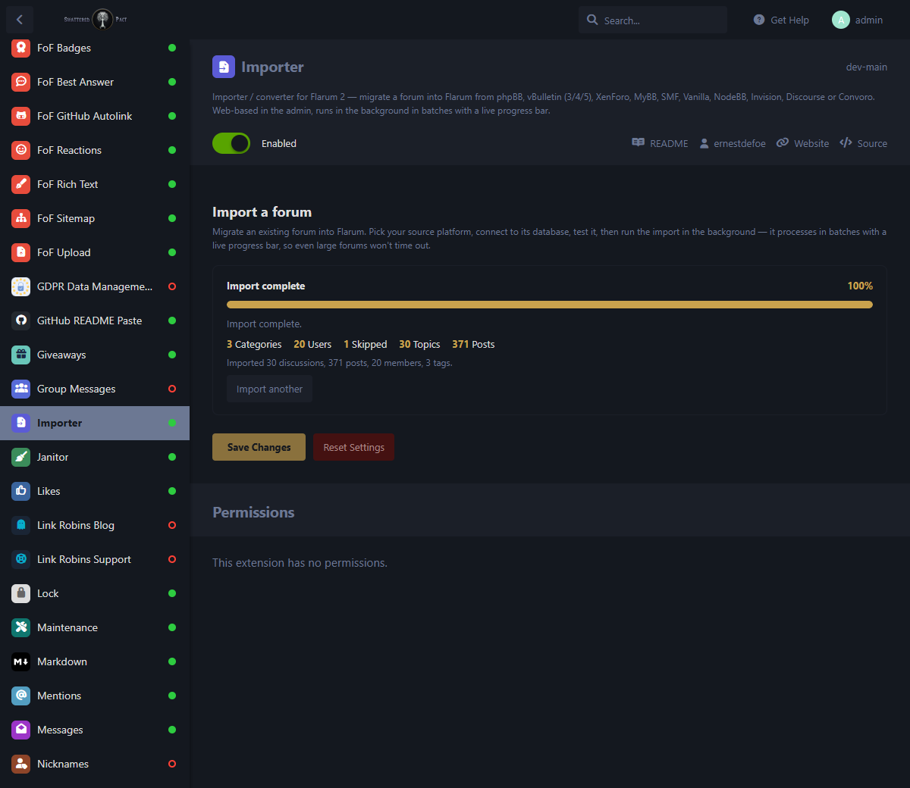

# Importer / Converter for Flarum 2

Migrate an existing forum into **Flarum 2** — from **phpBB, vBulletin (3/4/5), XenForo, MyBB, SMF, Vanilla, NodeBB, Invision, Discourse**, or **Convoro**. Everything is driven from the **admin panel**: pick a platform, connect to its database (or upload a dump), test it, then run the import in **small batches with a live progress bar** — so even a large forum won't time out.

> Ported from the Convoro importer suite. Members keep their passwords where possible (bcrypt hashes are copied straight across; other formats are randomised so the member simply resets on first login). Post bodies are converted to Flarum's native rich-text format, so BBCode / HTML / Markdown comes across as real formatting — bold, italics, links, quotes, lists and code.

## Runs on shared hosting

No queue worker and no SSH required. The import runs as a loop of **small "step" requests straight from your browser**, each processing one bounded batch and returning — so it can never hit a web timeout. Progress and the source→Flarum id-maps are persisted in the database, so if the tab is closed or the connection drops, reopen the page and it **resumes exactly where it left off**. If you *do* have a queue worker (e.g. `fof/redis`), the import is handed to it and runs fully in the background instead — either way it's safe.

## The admin area

The whole tool lives on the extension's settings page.

### 1. The wizard

Pick a **source platform**, then either **connect to a database** (host, port, database name, username, password, and table prefix) or **upload a database file** (a `mysqldump` `.sql`/`.sql.gz`, or a SQLite file) for hosts that only hand you a dump. Nothing is written until you start.



### 2. Test the connection

**Test connection** validates the credentials, confirms it really is the platform you picked, then reports exactly what it found — here **21 Users, 4 Categories, 30 Topics, 371 Posts** — so you know it will pull the right data before committing. **Start import** only lights up once the test passes.



### 3. Watch it run

**Start import** kicks off the batched run and shows a **live progress bar** with the current phase and running totals — categories, members, topics and posts — updating as it goes.



When it finishes you get a summary of everything imported, and can start another.



## Supported sources

| Platform | Notes |
|----------|-------|
| phpBB 3.x | BBCode posts; bcrypt passwords copied across |
| vBulletin 3 / 4 · vBulletin 5 / 6 | one option covers both — vB5's node schema is auto-detected |
| XenForo 1.x / 2.x | BBCode posts; XF2 bcrypt passwords copied |
| MyBB 1.8 · SMF 2.0 / 2.1 | BBCode posts |
| Vanilla · NodeBB | Markdown / mixed formats; NodeBB reads its Redis store (needs the `redis` PHP extension) |
| Invision Community (IP.Board) | HTML posts, quotes & mentions cleaned up |
| Discourse | PostgreSQL source (needs `pdo_pgsql`) |
| Convoro | Convoro → Flarum; bcrypt passwords copied, so members keep their logins |

Categories are imported as **tags** (requires `flarum/tags`); if tags aren't installed, discussions and posts still import, just untagged.

## How it works

- **Timeout-proof** — the run is a resumable state machine; each request processes one small batch and returns, so memory stays flat and nothing runs long enough to time out. Works with or without a queue worker.
- **Resumable** — progress, cursors and the source→Flarum id-maps live in the database, so a run survives a closed tab, a reload, or a dropped connection.
- **Faithful content** — post bodies go source → HTML/Markdown → Flarum's formatter, landing in Flarum's native stored format so they render as proper rich text.
- **Relations preserved** — members, tags, discussions, first/last-post pointers, comment counts and participant counts are all rebuilt.

## Requirements & tips

- Import into a **fresh Flarum** for the cleanest result.
- A queue worker is **optional** — the import runs from the browser without one. If you have `fof/redis` + a worker, it runs in the background instead.
- There's also a CLI for very large migrations or scripting:

```bash
php flarum importer:run --source=phpbb \
  --host=127.0.0.1 --database=my_old_forum --username=root --password=secret --prefix=phpbb_
# add --test to only check the connection and show counts
```

## License

MIT © ernestdefoe
